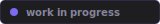

<div align="center">


[English](README.md) · **Русский** · [Français](README.fr.md)



</div>

<br>

<div align="center">

</div>

<br>

### Система

| | |
|:--|:--|
| ОС | Arch Linux |
| WM | Hyprland |
| Shell | zsh |
| Терминал | Kitty |
| Редактор | Neovim |
| Бар | Waybar |
| Виджеты | Quickshell |
| Лаунчер | Rofi |
| Уведомления | SwayNC |
| Движок тем | Matugen |
| Шрифты | JetBrains Mono · Iosevka NF |

### Структура

```
Secruple/
├── config/
│   ├── fonts/
│   ├── programs/        # конфиги программ
│   │   ├── hyprland/
│   │   ├── kitty/
│   │   ├── neovim/
│   │   ├── rofi/
│   │   ├── waybar/
│   │   └── zsh/
│   └── sessions/
│       └── hyprland/
├── previews/            # скриншоты — после настройки
├── install.sh
└── README.md
```

### Установка

> В процессе. Детали будут добавляться по мере готовности.

```sh
git clone https://github.com/Nerecson/Secruple
cd Secruple
./install.sh
```

<div align="center">
<br>

<br><br>
<sub>nerecson · 2026</sub>
</div>
